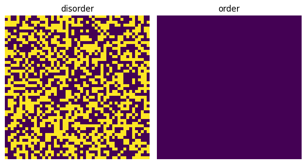

热统课上的一个作业,使用了Metropolis算法和Wolff算法模拟Ising模型

Ising Model的数值模拟
======
Ising模型简述
------
Ising模型是用来描述铁磁相变的一个著名的数学模型，也是最简单的复杂系统模型
每个格点具有一个自旋$\sigma$,自旋之间的作用选取最紧邻的相互作用，相互作用强度使用$J$来表示，第二项中的$h$为外加磁场

$$H(\sigma)=-\sum_{<ij>}J_{ij}\sigma_i\sigma_j-\mu\sum_jh_j\sigma_j$$

为了研究体系的相变特征，我们对模型做出两个简化：
- 自旋相互作用大小相等设为$J$
- 没有外磁场的作用，即$h=0$
此时哈密顿量可以被写为

$$H(\sigma)=-J\sum_{<ij>}\sigma_i\sigma_j$$

由于Ising模型和其他几个常用的描述铁磁的模型在数学上的高度抽象，因此可以被广泛使用在各学科的复杂系统之中，例如可以使用两种自旋表示两种观点，外场和相互作用强度表示观点的宣传和相互之间的影响，以此来描述传播学中的复杂系统；还可以将两种自旋方向表示为神经元的两种状态来进行神经网络的构建等等。

由于Ising模型的解析求解比较困难（至今尚未有通用的三维伊辛模型解析解）但其结构由非常简单，因此我们常用蒙特卡洛算法对Ising模型进行建模（但其实实际开始模拟会发现一些问题不是那么简单）。

## 算法构建
### 初步思路
我们现在想要模拟这个体系，考虑到如果有N个格点，那么如果我们需要遍历每个格点需要做$2^N$次，同时每一步之后状态都需要更新，所以我们使用随机抽样的方法来解决这个问题。首先，我们肯定无法确定这个体系应该是什么样的（否则也不需要进行模拟了）因此初态只能是我们假设出来的一个东西，要达到真实状态需要根据初态和系统的能量进行更新，达到能量最低的状态——即末态。


```python
import numpy as np
import matplotlib.pyplot as plt
#首先定义初始化的场，并绘图查看，我们可以任意假设初始状态的磁场分布
#因此这里使用了完全随机和完全非随机的两个状态进行对比
def initial_disorder_spin_field(M,N):
    return np.random.choice([-1,1],size=(M,N))
def initial_order_spin_field(M,N):
    return np.ones((M,N))
plt.figure()
plt.subplot(1,2,1)
plt.imshow(initial_disorder_spin_field(50,50))
plt.title('disorder')
plt.axis('off')
plt.subplot(1,2,2)
plt.imshow(initial_order_spin_field(50,50))
plt.title('order')
plt.axis('off')
plt.tight_layout()
plt.show()
```

